# Linux Fundamentals

## Problem
Your login name: altschool i.e., home directory /home/altschool. The home directory contains the following sub-directories: code, tests, personal, misc Unless otherwise specified, you are running commands from the home directory.

1. Change directory to the tests directory using absolute pathname
2. Change directory to the tests directory using relative pathname
3. Use echo command to create a file named fileA with text content ‘Hello A’ in the misc directory
4. Create an empty file named fileB in the misc directory. Populate the file with dummy content afterward
5. Copy contents of fileA into fileC
6. Move contents of fileB into fileD
7. Create a tar archive called misc.tar for the contents of misc directory
8. Compress the tar archive to create a misc.tar.gz file
9. Create a user and force the user to change his/her password upon login
10. Lock a user's password
11. Create a user with no login shell
12. Disable password-based authentication for ssh
13. Disable root login for ssh

**Mode of submission:**
You are going to push the required commands to your github repositories.

Deadline: 10th Feb 2024

## Solution
1. Change directory to the tests directory using absolute pathname
```cd /home/altschool/tests```
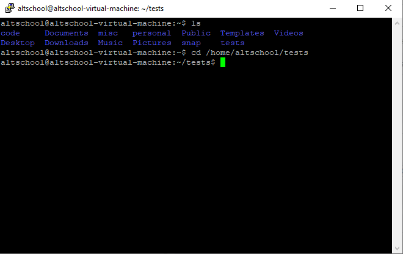
2. Change directory to the tests directory using relative pathname
```cd ./tests```
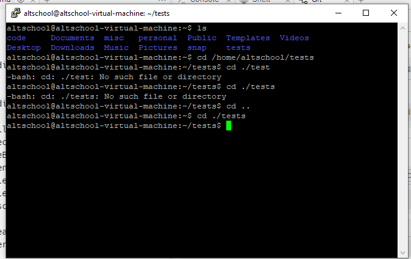
3. Use echo command to create a file named fileA with text content ‘Hello A’ in the misc directory
```echo "Hello A" > fileA```
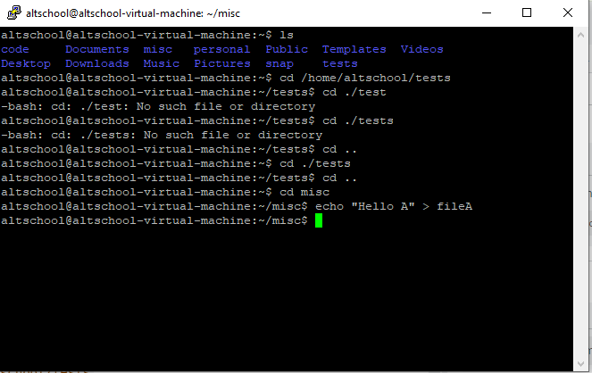
4. Create an empty file named fileB in the misc directory. Populate the file with dummy content afterward
```echo > fileB```

5. Copy contents of fileA into fileC
```sudo cp fileA fileC```
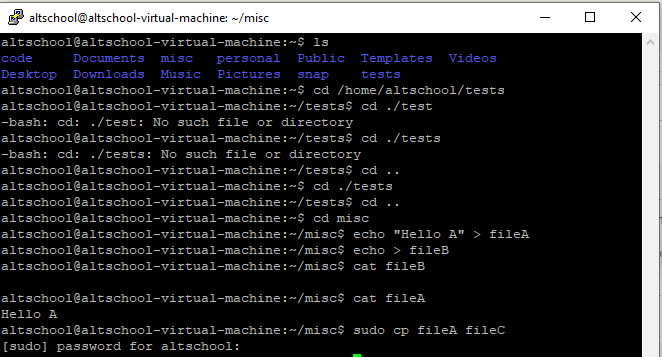
6. Move contents of fileB into fileD
```mv fileB fileD```
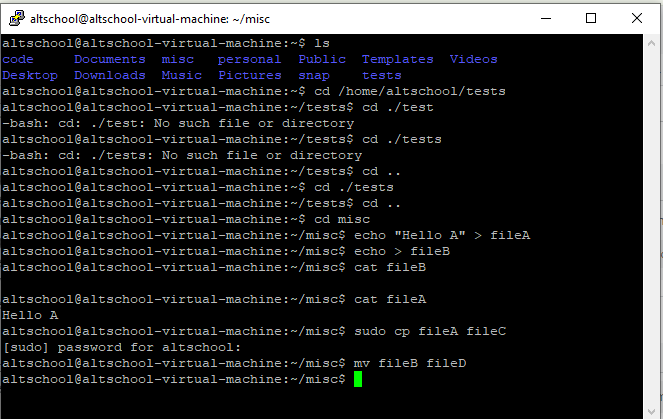
7. Create a tar archive called misc.tar for the contents of misc directory
```sudo tar -cvf misc.tar ./misc```
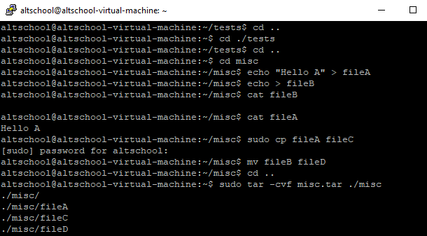
8. Compress the tar archive to create a misc.tar.gz file
```sudo gzip misc.tar```
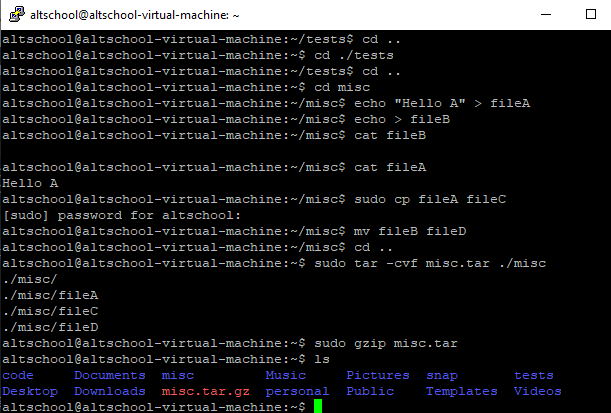
9. Create a user and force the user to change his/her password upon login
```sudo useradd piano && sudo passwd --expire piano```
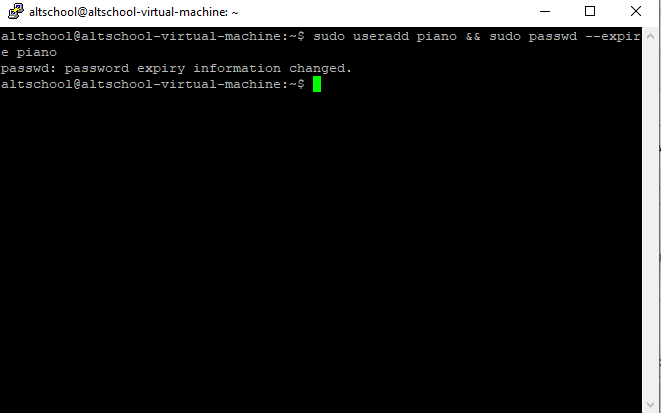
10. Lock a user's password
```sudo passwd --lock piano```
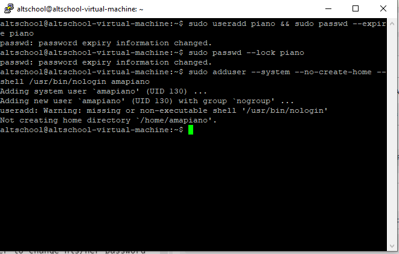
11. Create a user with no login shell
```sudo adduser --system --no-create-home --shell /usr/bin/nologin amapiano```
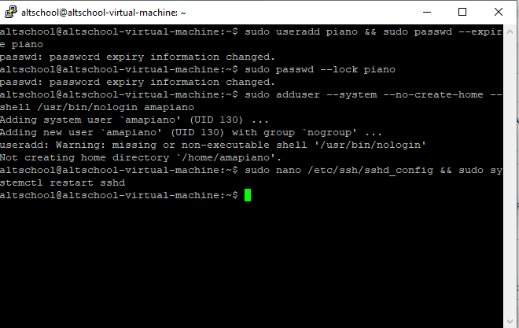
12. Disable password-based authentication for ssh
```sudo nano /etc/ssh/sshd_config && sudo systemctl restart sshd```
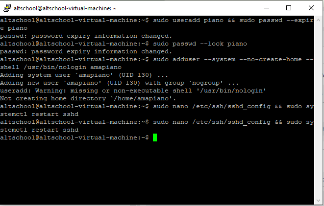
13. Disable root login for ssh
```sudo nano /etc/ssh/sshd_config && sudo systemctl restart sshd```
